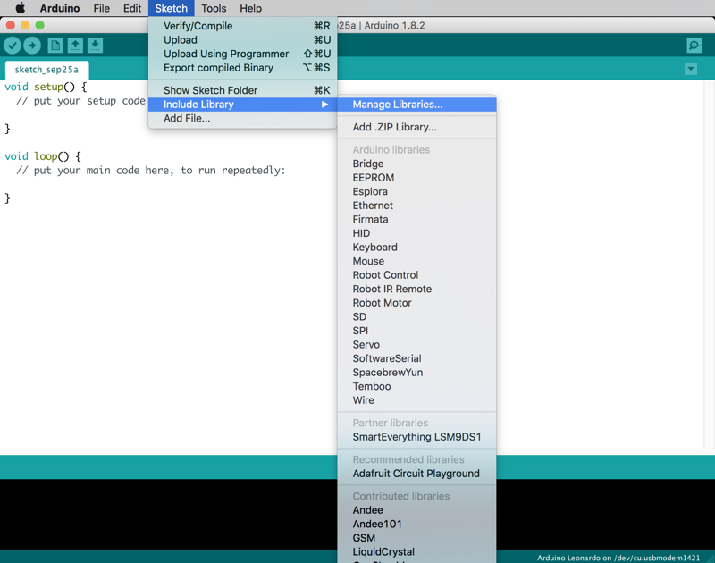
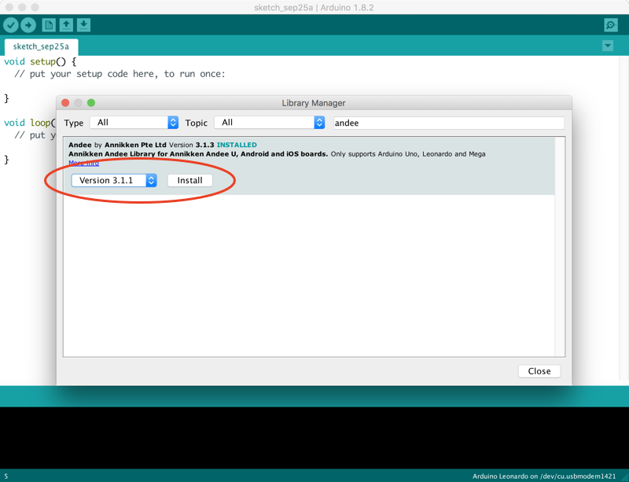

# Getting Started

This section will guide you in setting up your new Annikken Andee shield for your Arduino projects.

If you have just gotten your Annikken Andee shield, go through each step to ensure a smooth setup or you can skip to the relevant topic if you already have completed some of it.

If you come across any issues, please check our [support](https://annikken.github.io/) page for your relevant product. If the solution is not available there, feel free to [contact us](mailto:andee@annikken.com).

## Installing Arduino IDE

Coding for Arduino and Annikken Andee is done using the Arduino Integrated Development Environment(IDE). Before you proceed, you should ensure that you have the Arduino IDE installed on your computer.

If the Arduino IDE is not installed, proceed to download the Arduino IDE at [Arduino](https://www.arduino.cc/en/software). Just get the latest version.

## Installing Andee Library

The Annikken Andee Library can be easily installed by using Arduino IDE's built-in library manager. Follow these steps to install the Andee Library.

1. In your Arduino IDE, select Sketch >> Include Library >> Manage Libraries.  

2. Filter the library search by typing "andee" into the search box in the top right corner.  

    
3. Select the latest version from the drop down menu and hit install.  

### You are now ready to create your UI on the Annikken Andee

Proceed to the [Before You Code Section](BeforeYouCode.md) to learn the code that using Andee require or you can go straight to tutorials on the Andee Library in Arduino IDE
 

