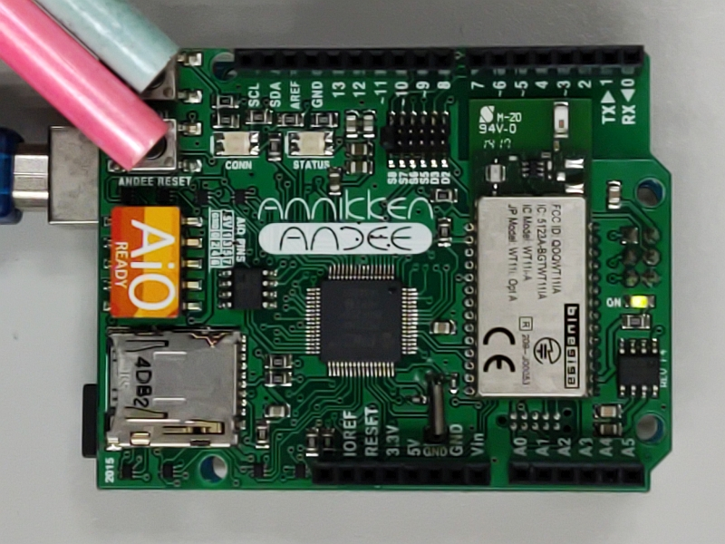
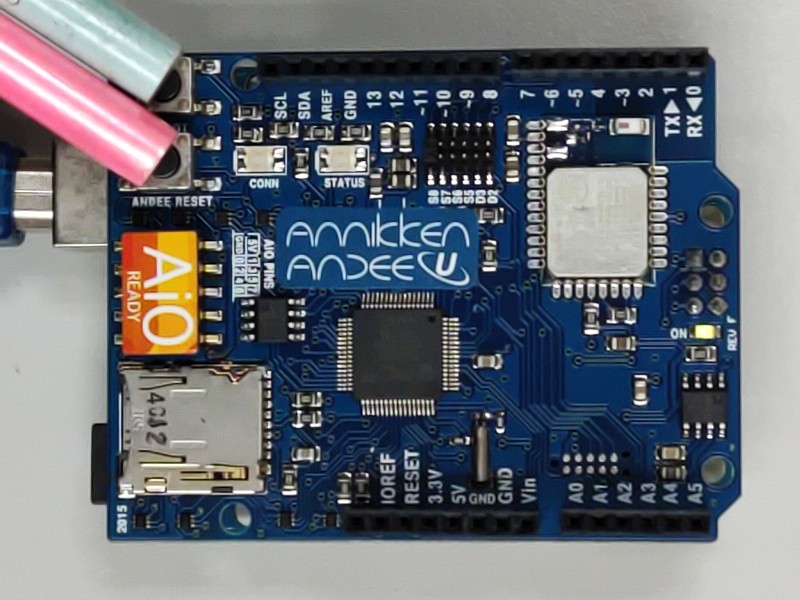
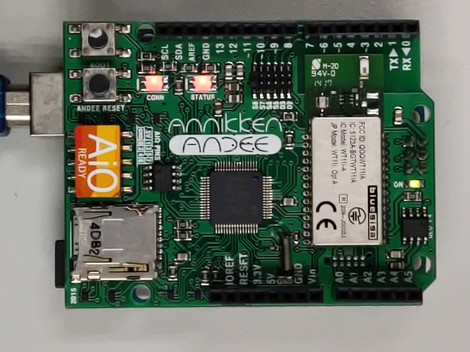
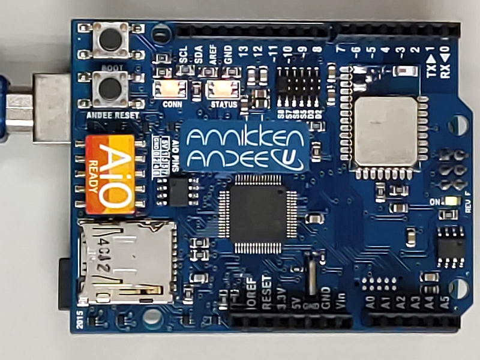
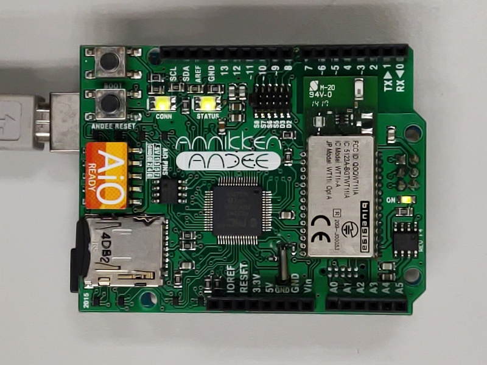
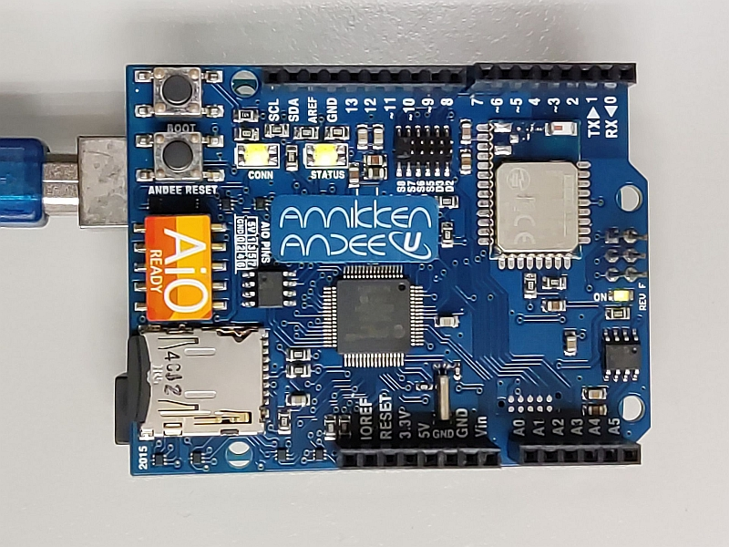
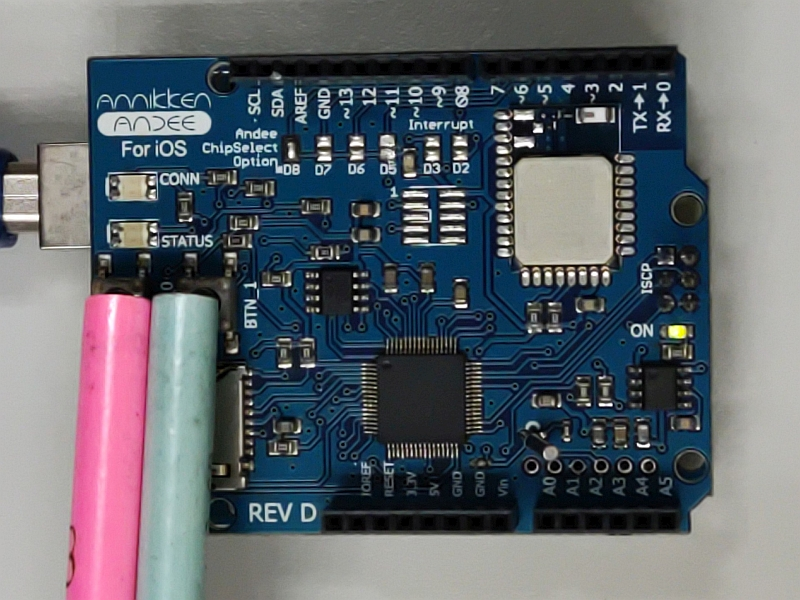
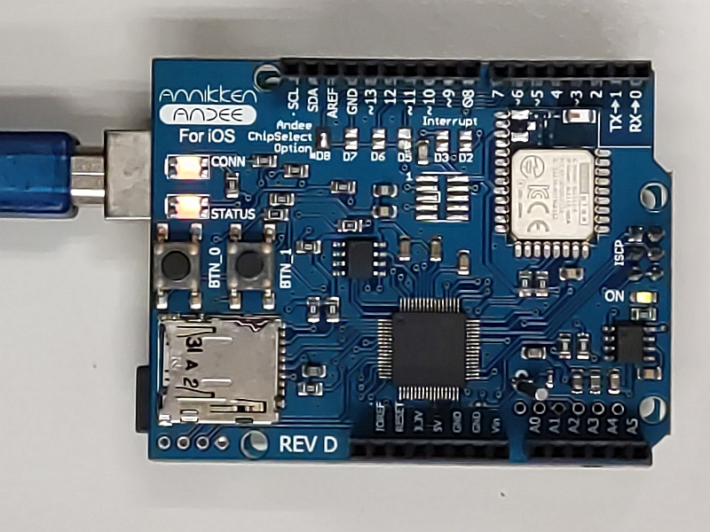
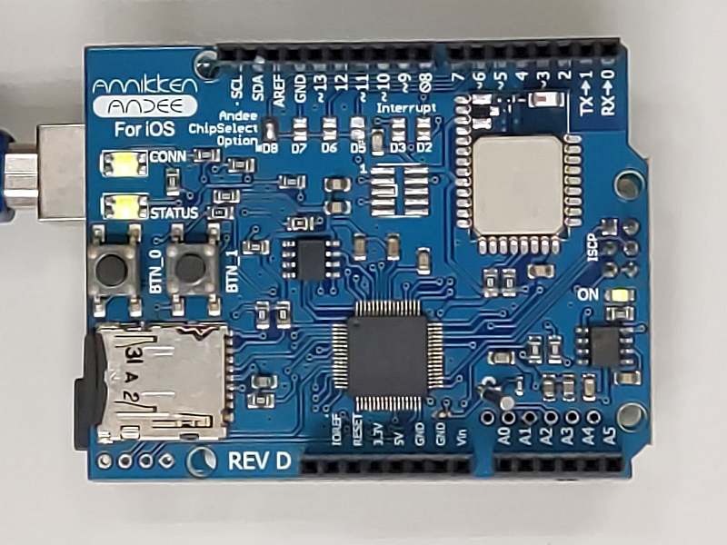

# Troubleshooting

## Common Problems Seen on Andee

| Problem | Solution |
| ------- | -------- |
| Connection LED blinking or solid RED   when phone is not connected to it | Remove the USB cable from the   Arduino and attach it again (Power cycle). |
| Status LED blinking or solid Red | Remove the USB cable from the   Arduino and attach it again (Power cycle). |
| Phone is connected to Andee  but no UI on display | Try these in order <ul><li>Check to make sure Andee is not paired to the phone.</li><li>Power cycle the Arduino.</li><li>Check and make sure `yourwidgetname.update()` is in your code.</li><li>Check to make sure Andee app is updated.</li><li>Check to make sure Andee firmware is the latest (v3.1.0).</li></ul> |
| Your Andee Board is the Android board but does not look like the one shown on this site  | Please email us at andee@annikken.com |

Please [email us](mailto:andee@annikken.com) if the problem you are having is not listed above or if you are unsure aboutusing the Andee board.

## Installing Andee Firmware

Annikken regularly releases new firmware updates for the Andee U, iOS and Android. It is recommended that you update the firmware on your shield when a new update is released. To do so, you require the following items:

* 1x Micro SD Card.
* 1x Micro SD Card Reader/Writer (or a computer capable of reading/writing Micro SD Cards).
* 1x Arduino Board.
* 1x Annikken Andee U/iOS/Android shield.

### Andee U/Android

This section provides instructions for firmware installation/upgrade for Annikken Andee U and Andee Android shields. Please follow the steps:

1. Download the latest firmware for your Andee shield listed below if you have not done so.
    * [Andee U](https://github.com/Annikken/annikken.github.io/raw/main/AndeeU%26iOS3.1.0.zip)
    * [Andee Android](https://github.com/Annikken/annikken.github.io/raw/main/Android3.1.0.zip)

2. Extract the zip file and copy "image.hex" into your Micro SD card.

3. Connect the Annikken Andee to the Arduino and power it up. You should see an LED blinking. The Andee is in "Normal Mode".

4. We will now need to put the Andee into "Update Mode". Press and hold down the "BOOT" and "ANDEE RESET" buttons together. Don’t let go of them yet!

5. While still holding down the "BOOT" button, release the "ANDEE RESET" button. You should see that "CONN" and "STATUS" LEDS are now flashing RED together.

6. Now let go of the "BOOT" button. 

7. Insert the Micro SD card containing "image.hex" you loaded earlier into the Annikken Andee's SD card slot. Annikken Andee will automatically start updating. The LEDs will flash red and green consecutively. Do not power down the shield at this time.

8. Once the update/installation has completed, the "CONN" and "STATUS" LEDs will start to blink green again.

You're done! Your Annikken Andee Shield is now updated with the latest firmware!

### Andee iOS

This section provides instructions for firmware installation/upgrade for Annikken Andee iOS shields. Please follow the steps:

1. Download the latest firmware for Andee iOS [here](https://github.com/Annikken/annikken.github.io/raw/main/AndeeU%26iOS3.1.0.zip) if you have not done so.

2. Extract the zip file and copy "image.hex" into your Micro SD card.

3. Connect the Annikken Andee to the Arduino and power it up. You should see an LED blinking. The Andee is in "Normal Mode".

4. We will now need to put the Andee into "Update Mode". Press and hold down the "BTN_0" and "BTN_1" buttons together. Don’t let go of them yet!

5. While still holding down the "BTN_1" button, release the "BTN_0" button. You should see that "CONN" and "STATUS" LEDS are now flashing RED together.

6. Now let go of the "BTN_1" button. 

7. Insert Micro SD card containing "image.hex" you loaded earlier into the Annikken Andee's SD card slot. Annikken Andee will automatically start updating. The LEDs will flash red and green consecutively. Do not power down the shield at this time.

8. Once the update/installation has completed, the "CONN" and "STATUS" LEDs will start to blink green again.

You're done! Your Annikken Andee iOS shield is now updated with the latest firmware!